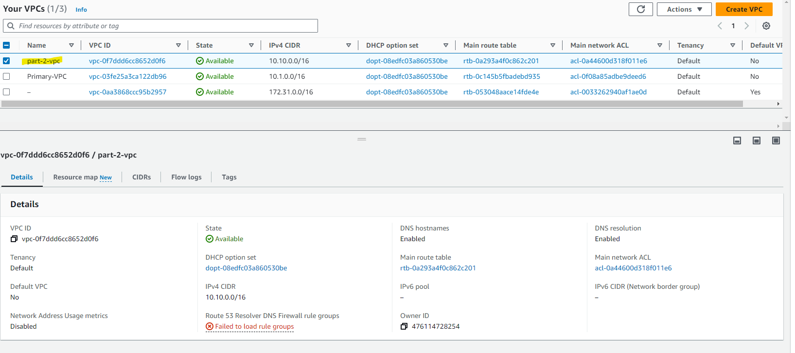

# Project: Design, Provision and Monitor AWS Infrastructure at Scale
## Task 1: Create AWS Architecture Schematics
### Part 1: Plan and provision a cost-effective AWS infrastructure for a new social media application development project for 50,000 single-region users.
[Udacity_Diagram_1](Udacity_Diagram_1.pdf)

>

### Part 2: Plan a SERVERLESS architecture schematic for a new application development project
[Udacity_Diagram_2](Udacity_Diagram_2.pdf)

>

## Task 2: Calculate Infrastructure Costs
- For the initail Cost Estimate with target a monthly estimate between $8,000-$10,000.
[Initial_Cost_Estimate.csv](Initial_Cost_Estimate.csv)

- Limit bugdet to a maximum of $6,500.
[Reduced_Cost_Estimate.csv](Reduced_Cost_Estimate.csv)

- Re-configure your estimate to a monthly invoice of $18K-20K.
[Increased_Cost_Estimate.csv](Increased_Cost_Estimate.csv)

## Task 3: Configure Permissions. (N/A)
## Task 4: Set up Cost Monitoring (N/A)
## Task 5: Use Terraform to Provision AWS Infrastructure
### Part 1
- Run terraform follow command.txt
>
>

### Part 2
- Run terraform follow command.txt
>
>
>

## Task 6: Destroy the Infrastructure using Terraform and prepare for submission
>