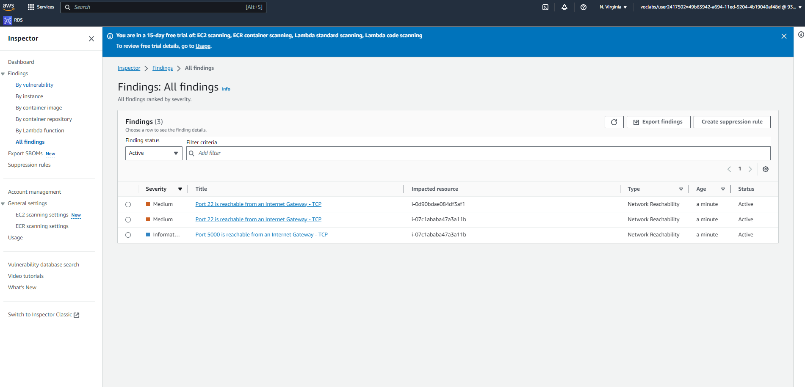
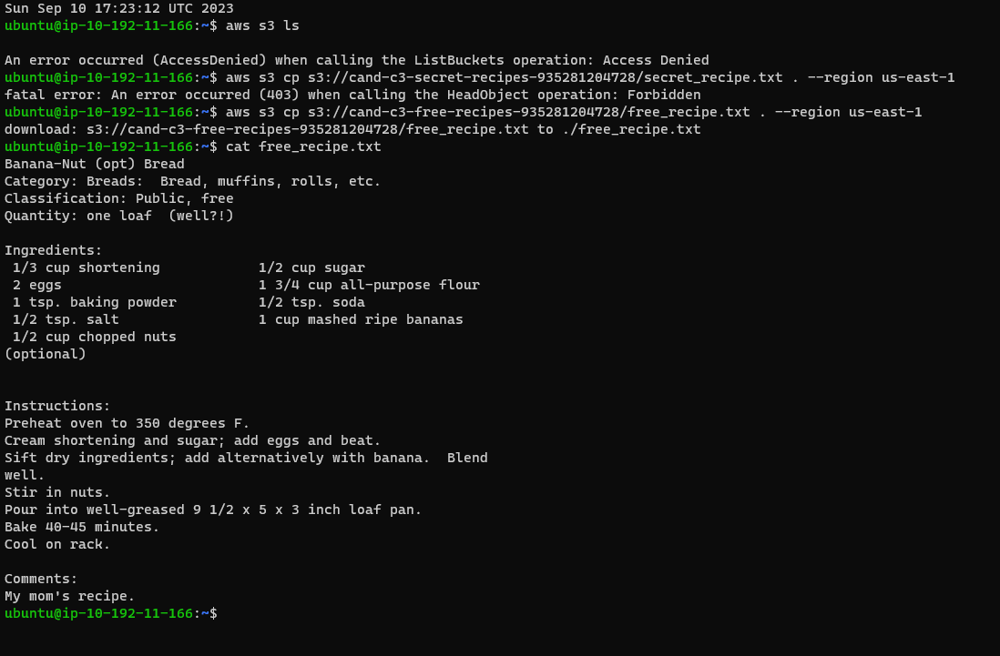
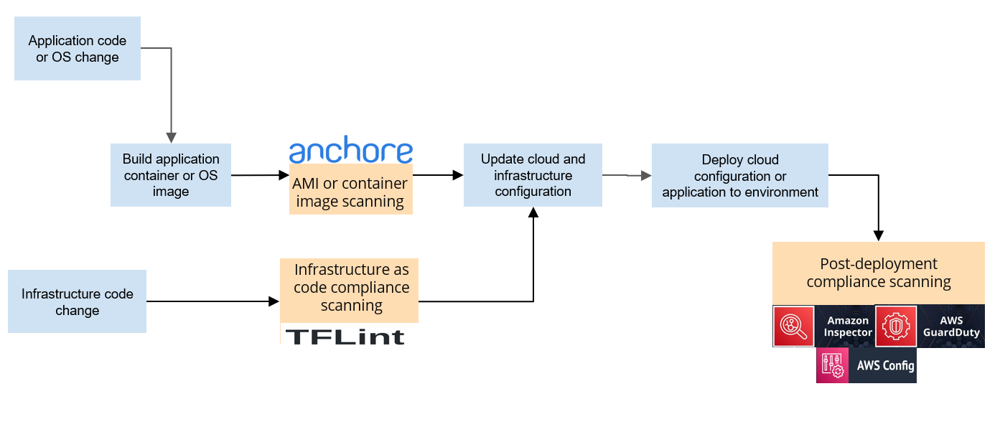

# Project: Secure the Recipe Vault Web Application
## Section 1: Security Monitoring
### Clearly identify network and server-level vulnerabilities:
#### - A text file, titled E1T4.txt, showing that the student was able assess the initial deployment architecture to identify some obvious security vulnerabilities.
- [E1T4.txt - Text file identifying 2 poor security practices with justification.](E1T4.txt)

#### - A screenshot, titled E2T2_inspector.png, of the inspector that shows server vulnerabilities and misconfigurations.
>

#### - A screenshot, titled E4T3_inspector.png, of the inspector after they have remediated the vulnerabilities showing that the fixes made reduced overall vulnerabilities.
>

### Implement and be alerted on suspicious activity
#### - A screenshot, titled E3T1.png, of Guard Duty showing that an ssh brute force attack was detected.
>

#### - A text file, titled E3T1.txt, which answers the questions in Exercise 3 Task 1 illustrating that the student was able to correlate the event with the detection and understand from AWS documentation of GuardDuty that the nature of the suspicious traffic is from VPC flow logs.
- [E3T1.txt](E3T1.txt)

### Set Up monitoring for assessment of AWS security configuration
#### - A screenshot, titled E2T2_securityhub.png, of AWS Security Hub that shows the number of vulnerabilities in Exercise 2, Task 2 which is before they have implemented their changes.
>

#### - A screenshot, titled E2T2_config.png, of AWS Config that shows the number of vulnerabilities in Exercise 2, Task 2 which is before they have implemented their changes.
>

#### - A screenshot titled, E4T3_securityhub.png, of AWS Security Hub that shows that shows the number of vulnerabilities in Exercise 4, Task 3 which is after they have implemented their changes.
>

#### - A screenshot, titled E4T3_config.png, of AWS Config that shows the number of vulnerabilities in Exercise 4, Task 3 which is after they have implemented their changes.
>

#### - A text file, titled E2T2.txt which provides recommendations on how to remediate the vulnerabilities.
- [E2T2.txt](E2T2.txt)

## Section 2: Apply Cloud Security Hardening
### Create a plan to implement security hardening
#### - A text file title, E4T1.txt, that illustrates their remediation plan.
- [E4T1.txt](E4T1.txt)

#### - A screenshot, titled E4T2_s3encryption.png, showing that default encryption has been enabled.
>

### Harden the environment's network access controls.
#### - Two screenshots, titled E4T2_networksg.png, of changes to security group rules to only accept traffic from specific ports and another title E4T2_sshattempt.png which is a screenshot of their SSH attempt.
>
>

### Update authorization policies to be "least privilege"
#### - A screenshot, titled E4T2_s3iampolicy.png, for the IAM policy showing that they only have access to the specific resources.
>

## Section 3: Security Testing
### Simulate a brute force attack and observe security controls in action
#### - A screenshot, titled E3T1_guardduty.png, showing that Guard Duty was able to detect the attack.
>

#### - A screenshot, titled E4T2_sshbruteforce.png, showing that after remediation of the SSH vulnerability, the brute force attack no longer worked.
>

### Simulate an attacker that has breached an instance stolen API keys, observe the impact, and monitor events generated
#### - A screenshot, titled E3T2_s3breach.png, showing output of the command allowing the attacker to steal secret data from the S3 bucket.
>

#### - A screenshot, titled E4T2_s3copy.png, showing output of the command denying the attacker access to the S3 bucket.
>

##  Section 4: DevSecOps Pipeline Design
### Incorporate cloud security checks into a basic cloud deployment pipeline
#### - A screenshot or ppt, titled DevSecOpsPipeline.[ppt or png]
>

### Select tools and document DevSecOps pipeline
#### - A text file, titled E5T2.txt, which lists tools as well as example vulnerabilities that can be identified with each tool.
- [E5T2.txt](E5T2.txt)

